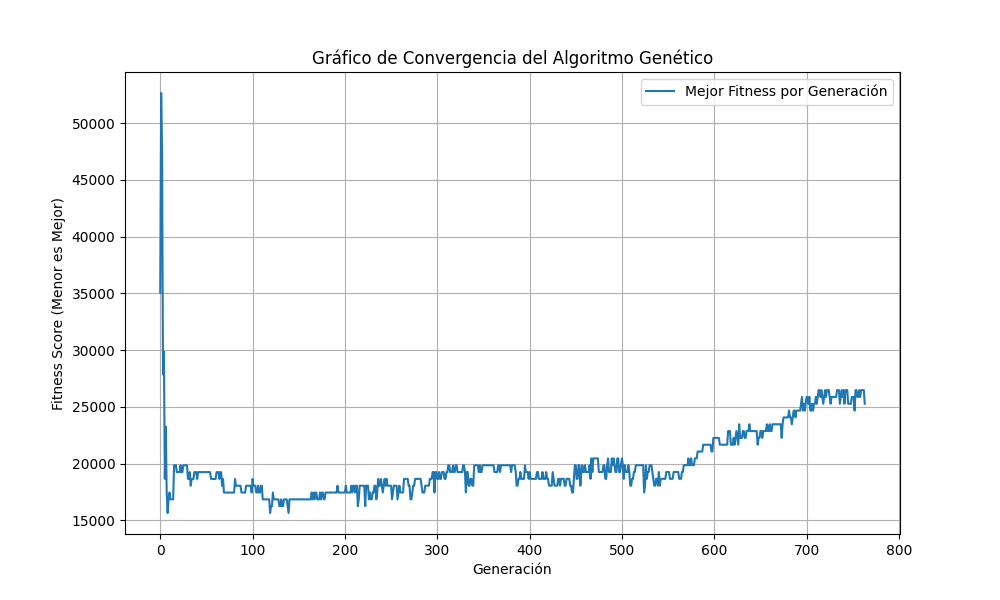

# Informe Técnico: Resolución de Laberintos con Algoritmos Genéticos

## 1. Introducción al Problema

El presente documento detalla la implementación de un algoritmo genético (AG) para resolver laberintos, una tarea clásica en el campo de la inteligencia artificial que modela problemas de planificación de rutas en entornos con restricciones. El objetivo es encontrar un camino válido desde un punto de inicio hasta un punto final, optimizando ciertos criterios como la longitud del camino o el número de giros.

El laberinto se representa como una matriz bidimensional donde las celdas pueden ser transitables (valor 0) o muros infranqueables (valor 1). La solución a este problema combinatorio se aborda mediante un enfoque evolutivo, inspirado en la selección natural.

## 2. Abordaje de la Solución

Para resolver este problema, se ha desarrollado un algoritmo genético en Python (`maze_solver.py`). Este enfoque se basa en las ideas presentadas en el paper de referencia "Genetic algorithm for path planning of UAVs as a maze-solving problem", pero introduce modificaciones sustanciales para mejorar la eficiencia y la calidad de la solución.

La solución propuesta se centra en los siguientes componentes clave:

### 2.1. Representación del Cromosoma

A diferencia de la propuesta del paper que resulta ambigua y menciona cromosomas de longitud fija y muy grande, nuestra implementación utiliza un **cromosoma de longitud variable**. Cada cromosoma es una lista de enteros que representa una secuencia de movimientos (1: abajo, 2: derecha, 3: arriba, 4: izquierda).

Esta flexibilidad permite al algoritmo explorar caminos de diferentes longitudes de forma dinámica, adaptándose a la complejidad y tamaño de cualquier laberinto sin necesidad de definir un tamaño máximo estricto y a menudo ineficiente.

### 2.2. Función de Aptitud (Fitness)

La evaluación de cada individuo (camino) se realiza a través de una función de aptitud que penaliza características no deseadas. Un valor de fitness más bajo indica una mejor solución. La función agrega los siguientes componentes:

- **Distancia a la Meta:** Distancia euclidiana desde el último punto del camino hasta la salida.
- **Longitud del Camino:** Número total de pasos.
- **Colisiones:** Penalización por chocar contra muros o salirse de los límites.
- **Cambios de Movimiento:** Penalización por girar en puntos de decisión.
- **Penalización por Revisita (Innovación Clave):** Se introduce una penalización muy alta (`k5 = 10000.0`) por cada vez que el camino pasa por una celda previamente visitada. Este es un aporte fundamental no detallado en el paper, que desincentiva fuertemente los bucles y ciclos, guiando al algoritmo hacia soluciones más directas y eficientes.

### 2.3. Operadores Genéticos

- **Selección:** Se utiliza una selección por ranking, donde los individuos con mejor fitness (la mitad superior de la población) son seleccionados para la reproducción.
- **Crossover:** Se implementa un crossover de dos puntos modificado para intercambiar material genético entre dos padres y generar descendencia.
- **Mutación:** La mutación tiene una alta probabilidad de ocurrir (80%) y puede manifestarse de two formas:
    1.  **Cambio de gen:** Altera un movimiento existente en el camino.
    2.  **Inserción de gen:** Añade un nuevo movimiento en una posición aleatoria. Esto, combinado con el cromosoma de longitud variable, es crucial para la exploración de nuevas rutas.

## 3. Análisis del Código Fuente Relevante

El archivo `maze_solver.py` contiene la clase `GeneticMazeSolver` que encapsula toda la lógica. A continuación se explican sus partes más relevantes.

### `solve()`
Es el bucle principal del algoritmo. Itera a través de las generaciones, evaluando la población, seleccionando a los mejores individuos, aplicando crossover y mutación, y registrando el mejor fitness de cada generación para analizar la convergencia.

```python
def solve(self):
    population = [self.random_individual() for _ in range(self.pop_size)]
    fitness_history = []

    for gen in range(self.max_gen):
        scores = [self.fitness(ind) for ind in population]
        best_score = min(scores)
        fitness_history.append(best_score)
        # ... (selección, crossover, mutación) ...
    return best, fitness_history
```

### `fitness()`
Calcula el coste de un camino. La inclusión de `revisit_count` es la modificación más importante respecto al paper.

```python
def fitness(self, individual):
    path, crash, m_changes, pen, revisit_count = self.simulate(individual)
    last = path[-1]

    dist = np.linalg.norm(np.array(last) - np.array(self.goal))
    steps = len(path)

    # La penalización k5 * revisit_count es clave
    return dist + self.k1*m_changes + self.k2*steps + self.k3*crash + self.k4*pen + self.k5*revisit_count
```

---

## 4. Inconvenientes Encontrados y Soluciones

### 4.1. Algoritmo Genérico para Diferentes Tamaños de Laberinto
- **Inconveniente:** Un algoritmo que depende de una estructura fija (ej. longitud de cromosoma fija) no puede generalizar a laberintos de distintos tamaños o complejidades.
- **Solución:** La implementación de **cromosomas de longitud variable** fue la solución directa. El AG puede empezar con caminos cortos e irlos alargando a través de la mutación de inserción, permitiendo que la longitud de la solución "crezca" hasta adaptarse al laberinto que se le presente. Los parámetros `min_len` y `max_len` solo establecen límites razonables para la búsqueda.

### 4.2. Ineficiencia del Cromosoma Fijo y Bucles
- **Inconveniente:** El paper de referencia propone un esquema de "gen-change" condicional que es complejo y, en la práctica, menos eficiente que un enfoque más directo. Además, sin un mecanismo explícito, los AG tienden a generar caminos con bucles y movimientos redundantes.
- **Solución:** Se descartó el enfoque del paper y se optó por la **representación de longitud variable**. Para el problema de los bucles, se introdujo la **penalización por revisita** en la función de fitness. Esta penalización actúa como una fuerte presión selectiva contra los individuos que se cruzan a sí mismos, forzando la evolución de caminos más directos y eficientes.

## 5. Resultados: Gráfico de Convergencia

Para visualizar el rendimiento del algoritmo, se ejecutó una simulación y se registró el fitness del mejor individuo en cada generación. El siguiente gráfico muestra cómo el fitness de la mejor solución disminuye rápidamente en las primeras generaciones, estabilizándose a medida que el algoritmo converge hacia una solución óptima.



Este comportamiento es típico de los algoritmos genéticos y demuestra que la búsqueda es efectiva, encontrando rápidamente soluciones de alta calidad.

## 6. Conclusión

El algoritmo genético implementado ha demostrado ser una herramienta robusta y eficaz para la resolución de laberintos. Las decisiones de diseño clave, como el uso de cromosomas de longitud variable y la introducción de una penalización por revisitar celdas, han sido cruciales para superar las limitaciones de los enfoques teóricos y lograr un algoritmo que no solo funciona, sino que también es adaptable y eficiente.
